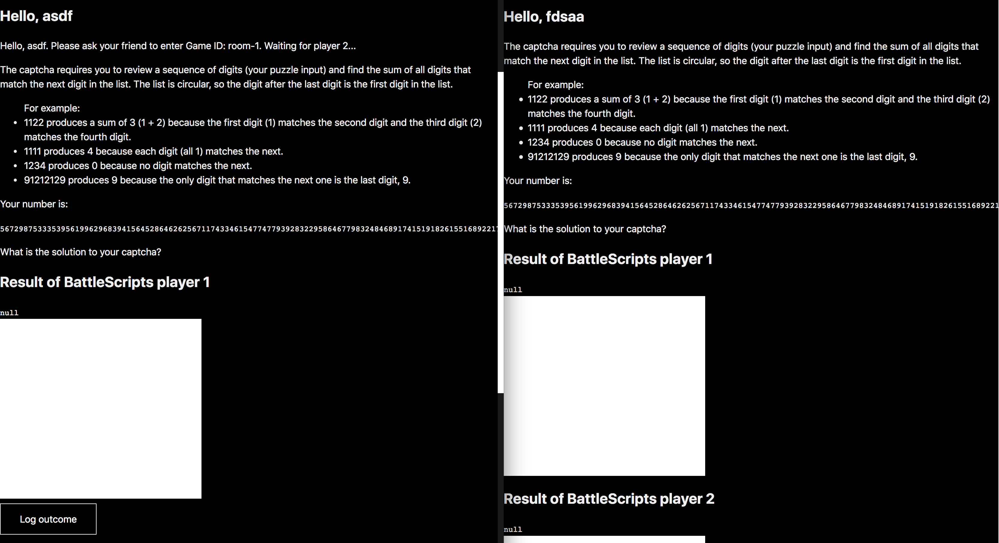

# BattleScripts

This is the course repo for the 2018 edition of the course 'Real Time Web' which is part of the minor 'web' taught at the University of Applied Sciences Amsterdam.

This project is built with `socket.io` and is used for basic communications via a chat.  

<br/>
<p align="left">
  
</p>
<br/>

- **[About this project](#about-this-project)**  
- **[Installing](#installing)**  
- **[Technology used](#technology-used)**  
- **[Eval](#eval)**  
- **[Sockets](#sockets)**  

## About this project
BattleScripts is a two player game where you each have to solve the same code problem with JavaScript while being able to see the code your opponent writes. 

## Installing
install  
```javascript
npm install
```  
run
```javascript
yarn dev
```
upload
```javascript
now --public
```

## Technology used  
This project includes:  
- Node
- Express
- Socket.io  
- CodeMirror

## Eval
`eval()` makes a string into a function and executes it.  
_eval() is a dangerous function, which executes the code it's passed with the privileges of the caller. If you run eval() with a string that could be affected by a malicious party, you may end up running malicious code on the user's machine with the permissions of your webpage / extension. More importantly, a third-party code can see the scope in which eval() was invoked, which can lead to possible attacks in ways to which the similar Function is not susceptible._ - MDN

## Sockets
- `createGame`, creates a new game and room  
- `joinGame`, lets a second player join a game  
- `player1`, emits info for player1  
- `player2`, emits info for player2  
- `changes`, gets all changes in the editor and emits them
- `gameEnded`, ends the game
- `gameWon`, broadcast to certain player who won  
